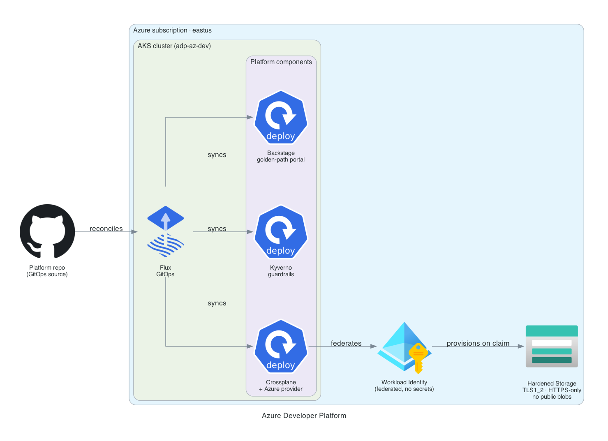

# Azure Developer Platform

[](https://github.com/jordann6/azure-developer-platform/actions/workflows/validate.yml)

An Internal Developer Platform on AKS that gives application teams a paved road: self-service infrastructure, GitOps delivery, golden-path scaffolding, and policy guardrails. It is the Azure counterpart to [aws-developer-platform](https://github.com/jordann6/aws-developer-platform), built deliberately on a different toolchain to show the pattern is not cloud or tool specific.

## Architecture



| Layer | Tool | Role |
|---|---|---|
| Cluster substrate | **AKS** (Terraform) | OIDC issuer + workload identity, provisioned as code |
| GitOps | **Flux** | `GitRepository` + `Kustomization` + `HelmRelease` reconcile the platform |
| Self-service infra | **Crossplane** + Azure provider | A `StorageAccount` claim provisions a real, hardened storage account |
| Identity | **Azure Workload Identity** | The Crossplane provider federates a token, no client secrets |
| Guardrails | **Kyverno** | Policy-as-code admission control |
| Developer portal | **Backstage** | Golden-path microservice template (shared with the AWS platform) |

## How it differs from the AWS platform

Same pattern, different implementation, so the two repos together show cross-cloud range:

| AWS platform | This (Azure) |
|---|---|
| EKS | AKS |
| ArgoCD app-of-apps | Flux (`GitRepository` + `Kustomization` + `HelmRelease`) |
| IRSA | Azure Workload Identity (federated credential) |
| `provider-aws-s3`, S3 `Bucket` | `provider-azure-storage`, `StorageAccount` |
| S3 Terraform backend | Azure Storage Terraform backend |

## The self-service flow

A developer applies a small claim (or uses the Backstage golden path):

```yaml
apiVersion: platform.jordann6.io/v1alpha1
kind: StorageAccount
metadata:
  name: demo-storage
  namespace: team-apps
spec:
  parameters:
    name: adpdemostore6271   # globally unique, 3-24 lowercase alphanumeric
    team: payments
```

Crossplane composes a real Azure Storage account that is **hardened by default**:

- Minimum TLS 1.2
- HTTPS-only traffic
- Public blob access disabled
- Infrastructure encryption enabled
- Owning-team tag applied

Crossplane authenticates through **Azure Workload Identity**: its pod is labeled for the workload-identity webhook and its ServiceAccount is federated to a user-assigned managed identity, so there are no client secrets in the platform.

## How it is wired

- **Flux:** `platform/flux/sync.yaml` defines the `GitRepository` and a root `Kustomization`; `platform/flux/apps/` declares the `HelmRelease`s (Crossplane, Kyverno) and child `Kustomization`s for the Crossplane config and Kyverno policies. Flux applies server-side and retries, so late-arriving CRDs converge on their own.
- **Crossplane:** `platform/crossplane/` holds the Azure provider (with a workload-identity `DeploymentRuntimeConfig`), the `ProviderConfig`, and the `XRD` + `Composition` defining the `StorageAccount` API.
- **Kyverno:** `platform/kyverno/require-team-label.yaml` enforces an owning-team label on pods in namespaces labeled `team-policy=enforce`.
- **Backstage:** the golden-path template under `backstage/templates/microservice/` produces a new service complete with a Dockerfile, a hardened Helm chart, and a GitOps Application.

## Deploy

```bash
cd terraform
terraform init && terraform apply
eval "$(terraform output -raw configure_kubectl)"

# Install Flux controllers, then point Flux at this repo
kubectl apply -f https://github.com/fluxcd/flux2/releases/latest/download/install.yaml
kubectl apply -f platform/flux/sync.yaml
```

The Crossplane manifests reference the managed identity's client ID, tenant, and subscription. Fill those from `terraform output` before committing if you redeploy.

## Try the self-service path

```bash
kubectl create namespace team-apps
kubectl apply -f examples/storageaccount-claim.yaml

kubectl get storageaccount.platform.jordann6.io -n team-apps
ACC=$(kubectl get account.storage.azure.upbound.io -o jsonpath='{.items[0].metadata.annotations.crossplane\.io/external-name}')
az storage account show -n "$ACC" -g rg-adp-az-workloads \
  --query "{tls:minimumTlsVersion, https:enableHttpsTrafficOnly, publicBlob:allowBlobPublicAccess}"

# Reclaim
kubectl delete storageaccount.platform.jordann6.io/demo-storage -n team-apps
```

## Teardown

```bash
kubectl delete storageaccount.platform.jordann6.io --all -A   # remove managed Azure resources first
cd terraform && terraform destroy
```

## Cost

AKS control plane is free (Free tier); cost is the node pool (two `Standard_D2s_v3`) while the cluster runs. Spin-up, demo, tear-down.

## Tech Stack

- **Terraform** `>= 1.6`, `azurerm ~> 3.100`, Azure Storage state backend
- **AKS** v1.33, OIDC issuer + workload identity
- **Flux** v2 (source, kustomize, helm controllers)
- **Crossplane** 1.20 with the Upbound Azure storage provider, workload-identity auth
- **Kyverno** 1.13 policy-as-code
- **Backstage** scaffolder golden-path template
